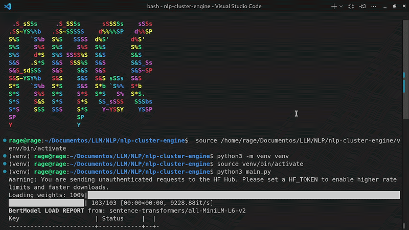

# NLP Cluster Engine

Sistema de Processamento de Linguagem Natural (NLP) para agrupamento semântico de sentenças utilizando embeddings e KMeans.

## 📌 Visão Geral

Este projeto implementa um pipeline de NLP capaz de agrupar frases com base em similaridade semântica e também classificar novas sentenças em clusters existentes.

O sistema utiliza embeddings pré-treinados para representar significado textual em formato numérico e aplica aprendizado não supervisionado para identificar padrões.

## 🎬 Demonstração

O sistema recebe um conjunto de sentenças, realiza o clustering semântico e identifica o grupo mais próximo para uma nova frase.



## 🧠 Como Funciona

O pipeline segue as seguintes etapas:

1. Conversão de sentenças em embeddings vetoriais usando Sentence Transformers
2. Representação das sentenças em um espaço vetorial semântico
3. Aplicação do algoritmo KMeans para agrupamento
4. Organização das sentenças em clusters
5. Classificação de novas sentenças com base na proximidade aos centróides

## ⚙️ Tecnologias

- Python
- NumPy
- Scikit-learn
- Sentence Transformers (all-MiniLM-L6-v2)

## 🚀 Instalação

```bash
git clone https://github.com/RageHTML/nlp-cluster-engine.git
cd nlp-cluster-engine
pip install -r requirements.txt